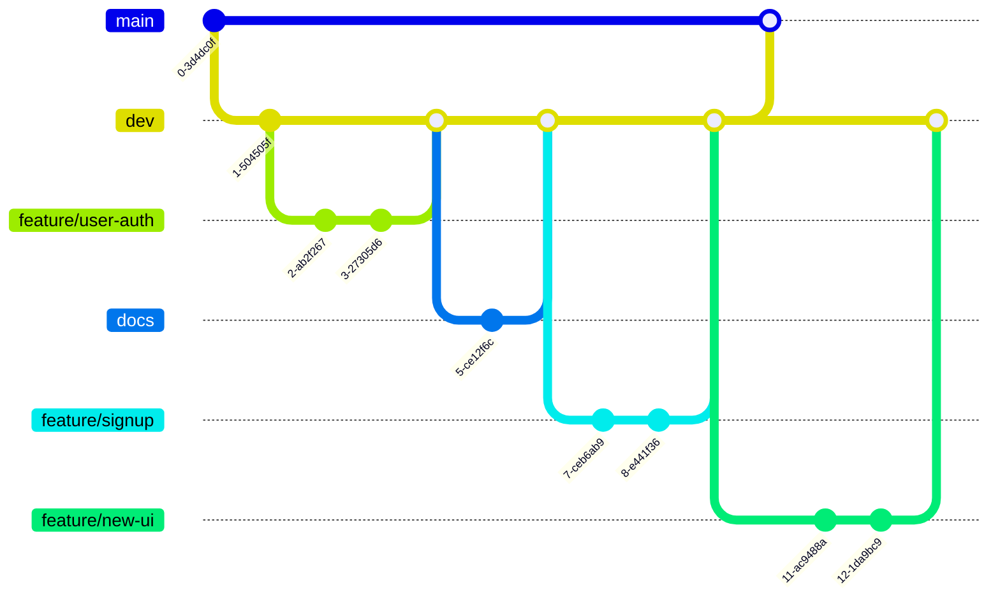

# AGENTS.md — PatentFlow Frontend

## Role of This Coding Agent

You are working as the frontend implementation agent for PatentFlow.

Your primary responsibility is the React/Vite frontend only.

Do not implement backend business logic, Spring Boot APIs, FastAPI services, LangChain agents, database schemas, or production deployment unless the user explicitly asks.

You may create frontend API client modules, mock API responses, types, fixtures, and integration placeholders that make the frontend ready for backend/AI integration.

## Project Overview

PatentFlow is an internal patent management AI workflow system.

- Service name: PatentFlow
- Team name: SYUUK
- Topic: Internal patent management AI
- Product role: AI-assisted patent review workflow
- Goal: Help legal/patent management teams and business departments review company-owned patents around annual fee payment points.
- Product nature: Human-in-the-loop decision-support workflow system, not a simple report generator.
- Current deployed frontend URL: `https://patentflow.live`

Core workflow:

```text
Review target identification
→ Patent understanding
→ AI patent evaluation report generation
→ Review and decision recording
→ Mailing / delivery
→ History management
→ Abandoned patent sales-candidate management
```

## Frontend Scope

The frontend should support the following user groups.

### 1. 관리자 / Legal Team User

The administrator can:

- View all patent status
- Manage patents under review
- Search, filter, and sort patent lists
- Register and edit patent basic information
- View AI evaluation results
- View evaluation evidence
- Record or edit final decisions and legal action results
- Manage mailing preview and sending history
- Manage department-recipient mappings
- Manage abandoned patents as sales candidates
- Manage settings and evaluation criteria

### 2. 사업부 사용자 / Business Department User

The business user can:

- View patents assigned to their department
- Understand patent content through summaries and explanations
- View AI patent evaluation reports
- Enter business-side opinions
- Upload internal documents for re-evaluation
- View re-evaluation results
- Submit maintain / abandon opinions

## Technology Stack

Use the existing frontend stack if already configured.

Planned frontend stack:

- React
- Vite
- TypeScript if already used or if setting up from scratch
- CSS Modules, plain CSS, Tailwind, or existing style system depending on the repository
- React Router if routing is needed and not already implemented
- No unnecessary heavy UI library unless the repository already uses one

Do not add new dependencies unless they are clearly needed.

If a dependency is needed, explain why.

## PatentFlow Reference Docs

Use the project documents in `docs/` as the managed reference set for frontend work.

Before creating or changing UI, layout, shared components, page styling, global CSS, mock data, API contracts, evaluation screens, or business review flows, check the relevant docs first:

- `docs/DESIGN_SYSTEM.md`: UI tone, design tokens, layout principles, component styling, and interaction states.
- `docs/UI.md`: official frontend UI ID list, screen composition, workflow procedure, constraints, and FR-to-UI traceability mapping.
- `docs/skax_patents_list.md`: primary source for demo patent metadata and patent list fixtures.
- `docs/patent_evaluation_criteria.md`: official PatentFlow patent evaluation criteria, evaluation axes, final comprehensive indicator, and final judgment categories.
- `docs/business_evaluavte_checklist.md`: business-side checklist reference for business relevance and internal review inputs.
- `docs/api_priority.md`: frontend/backend API priority, MVP API response shape, and enum coordination.
- `docs/need_api.md`: additional API needs and integration notes when present.
- `docs/prompt.md`: AI prompt/reference content when prompt behavior affects frontend copy or mock AI report structure.

Use `docs/DESIGN_SYSTEM.md` as the project design reference for:

- Overall UI tone: quiet, practical, enterprise workflow UI
- Design tokens for color, spacing, radius, shadow, and typography
- Layout principles for cards, sections, tables, forms, and status messages
- Interaction states such as hover, focus, selected, and disabled
- Rules to avoid unnecessary hero sections, decorative gradients, card nesting, and overly generic admin UI

Use `docs/patent_evaluation_criteria.md` as the project evaluation reference for:

- Evaluation axes: 권리성, 기술성, 시장성, 사업 연계성
- 사업 연계성 is a current AI evaluation scoring axis and must be included in `EvaluationCategory`, AI report score displays, and FE/API contracts.
- Final comprehensive indicator: 종합 가치 지표, 특허 가치 평가, 포트폴리오 내 가치 수준
- Business opinion categories: 유지, 포기
- Business review inputs and internal document upload assumptions
- Business opinion delivered state: checklist scores, qualitative evaluation, and final opinion must be submitted together
- Display rules for insufficient data: 정보 부족 있음, 추가 확인 필요, N/A

When frontend mock data, fixtures, demo patent rows, or patent list examples are needed, first check `docs/skax_patents_list.md`.

Use that file as the primary source for patent metadata such as:

- 관리번호
- 발명의 명칭(가제)
- 발명의 명칭(최종)
- 관련사업 분야
- 관련기술 분야
- 관련제품
- 출원국
- 공동출원여부
- 공동출원인명
- 상태
- 출원일
- 등록일
- 출원번호
- 등록번호
- 예상 소멸일

If the UI needs evaluation summaries, recommendations, business opinions, or history that are not present in `docs/skax_patents_list.md`, create clearly marked mock evaluation data around the real patent metadata instead of replacing the patent metadata with invented patents.

These docs do not override PatentFlow domain requirements, fixed FR IDs, official UI IDs, or existing component conventions.

If implementation details conflict, follow this priority:

1. Explicit user request
2. Fixed functional requirements and traceability rules in this AGENTS.md
3. Existing project structure and component patterns
4. Relevant `docs/` reference document

## Out of Scope for This Agent

Do not implement:

- Spring Boot backend
- FastAPI AI serving
- LangChain agents
- Database schema
- Production deployment
- Mobile app
- Automatic assignee allocation
- Commercial packaging
- Full patent sale price estimation agent

If backend or AI behavior is needed for FE development, use:

- typed API client functions
- mock data
- fixture files
- TODO comments for integration points

## Fixed Functional Requirements

Do not change the meaning or numbering of FR-001 through FR-022.

Frontend work should reflect these fixed requirements:

- FR-001: 검토 대상 특허 조회
- FR-002: 특허 목록 검색/필터링/정렬
- FR-003: 특허 기본 정보 등록
- FR-004: 회사 컨텍스트 입력/수정
- FR-005: 특허 내용 요약 생성
- FR-006: AI 기반 특허 가치 재평가 수행
- FR-007: 평가 근거 제공
- FR-008: 종합 권고안 생성
- FR-009: 사업부 의견 입력
- FR-010: 내부 문서 반영 재평가
- FR-011: AI 특허 평가 레포트와 최종 판단 분리 조회/수정
- FR-012: 최종 의사결정 기록
- FR-013: 평가/판단 이력 조회
- FR-014: 부서별 수신자 및 메일링 매핑 등록/수정
- FR-015: 메일 미리보기
- FR-016: 메일 발송 이력 저장/조회
- FR-017: 포기 특허를 매각 후보 리스트로 분류/조회
- FR-018~FR-022: Already assumed in project planning. Do not renumber earlier requirements.

If new frontend features are needed, label them from FR-023 onward only in documents. Do not alter existing FR IDs.

## Main Frontend Screens

Build or maintain these screens.

### Administrator Screens

- Admin Dashboard
- Patent Management
- Patent Registration / Edit
- Patent Detail
- Mailing
- Mailing History
- Sales Candidate Management
- Settings

### Business User Screens

- Business Dashboard
- Department Patent List
- Patent Detail for Business User
- Business Opinion Form
- Internal Document Upload
- Re-evaluation Result

## Important Screen: Patent Detail

Patent Detail is the most important screen.

It must help non-technical business users understand the patent before giving an opinion.

Include or prepare areas for:

- Patent basic metadata
- Why this patent is currently under review
- Patent summary
- Problem solved by the patent
- Core technical points
- Rights / claims summary
- AI patent evaluation report
- Evaluation score by category
- Evidence for each evaluation item
- Missing information or N/A fields
- Final decision
- Business department opinion
- Evaluation and decision history

The UI must clearly separate:

Use labels or visual separation such as:

- AI 특허 평가 레포트
- 최종 판단
- 사업부 의견
- 평가 근거
- 정보 부족 / 추가 확인 필요

## Evaluation UI Direction

Evaluation criteria should follow `docs/patent_evaluation_criteria.md`.

Evaluation axes:

- 권리성
- 기술성
- 시장성
- 사업 연계성

Final comprehensive indicator:

- 종합 가치 지표
- 특허 가치 평가
- 포트폴리오 내 가치 수준

Business opinion categories:

- 유지
- 포기

AI report recommendation labels:

- 유지 권고
- 포기 검토
- 추가 정보 필요

Workflow status labels should describe process state, such as:

- 사업부 응답 대기
- 처리 완료

Frontend should present AI output as a patent evaluation report or recommendation, not as an already-recorded decision.

When data is insufficient, display:

- 정보 부족 있음
- 추가 확인 필요
- N/A

Do not invent missing business data in frontend fixtures.

Mock data should clearly look like test data.

## Current Product Decisions To Preserve

The following decisions came from implementation review and should not be accidentally reverted:

1. 사업 연계성 is a current AI evaluation criterion. Current scoring uses 권리성, 기술성, 시장성, and 사업 연계성. Keep `BUSINESS_ALIGNMENT` in `EvaluationCategory` and AI report displays. Do not include `LIFECYCLE_ECONOMICS` as a current AI evaluation axis.
2. Do not put individual patent detail pages in the main nav. Patent detail screens are reached from dashboard/list rows.
3. The business dashboard is for current work. The `의견 요청 특허` table should show actionable request status only; do not add past-history links such as `제출 이력` inside the business opinion column. Submission history belongs in the dedicated `제출 이력` nav/page.
4. Business submission history detail is separate from normal business patent detail. `/business/submissions/:patentId` should show why the business made a prior choice, the AI report at that time, checklist evaluation history, and a small request/opinion/action timeline.
5. Checklist totals and detail scores must use the same source. Checklist total is item score sum plus qualitative score. Do not mix AI 0-100 evaluation scores with business checklist 1-4 item scores in the same total/detail display.
6. Avoid `N/A` for not-yet-written user input. Use action/state copy such as `작성 필요`, `대기 중`, or `의견 대기`. Reserve `N/A` for true not-applicable or missing source data.
7. Dashboard deadline cells should combine remaining days and date in one column:

```text
D-n
yy-mm-dd
```

Do not add a separate `남은 일` column unless explicitly requested.

8. Annual fee due dates are based on registration date: first due date is 3 years after registration, then every year. If the calculated due date has already passed, show the next yearly due date.
9. Notification UX should not use checkbox-style read controls. Group notifications by `오늘`, `지난주`, `그 이전`; show title top-left and time top-right; reveal `읽음으로 표시` / `읽지 않음으로 표시` on hover, and update the unread badge accordingly.
10. On the admin dashboard, the `관련 사업별 특허 현황` visualization should navigate to the same KPI drilldown list page used by dashboard KPI cards, with the selected business area passed as a query filter such as `/admin/review-targets?businessArea=AI`. Do not send this interaction to the patent management edit/list page, and do not implement it as an in-place filter that only changes the list below the dashboard visualization.

## Suggested Frontend Directory Structure

If the project already has a structure, follow it.

If not, prefer:

```text
src/
  app/
    router/
    providers/
  pages/
    admin/
      DashboardPage.tsx
      PatentManagementPage.tsx
      PatentDetailPage.tsx
      MailingPage.tsx
      SalesCandidatePage.tsx
      SettingsPage.tsx
    business/
      BusinessDashboardPage.tsx
      BusinessPatentListPage.tsx
      BusinessPatentDetailPage.tsx
      BusinessOpinionPage.tsx
      DocumentUploadPage.tsx
  components/
    common/
      Button.tsx
      Card.tsx
      Badge.tsx
      Table.tsx
      Modal.tsx
      EmptyState.tsx
      LoadingState.tsx
    layout/
      AppLayout.tsx
      Sidebar.tsx
      Header.tsx
    patent/
      PatentSummaryCard.tsx
      PatentMetaPanel.tsx
      WorkflowStatusBadge.tsx
      PatentFilterBar.tsx
    evaluation/
      EvaluationScoreCard.tsx
      EvaluationEvidenceList.tsx
      RecommendationBadge.tsx
      FinalDecisionPanel.tsx
    mailing/
      MailPreview.tsx
      MailingHistoryTable.tsx
      RecipientMappingForm.tsx
    upload/
      DocumentUploadBox.tsx
  api/
    client.ts
    patents.ts
    evaluations.ts
    mailing.ts
    salesCandidates.ts
    settings.ts
  mocks/
    patents.mock.ts
    evaluations.mock.ts
    mailing.mock.ts
  types/
    patent.ts
    evaluation.ts
    mailing.ts
    user.ts
  hooks/
  utils/
  styles/
```

## UI/UX Principles

Prioritize:

- Readability for legal and business users
- Clear workflow status
- Clear distinction between AI recommendation and human decision
- Evidence-based display
- Simple table filtering and sorting
- Empty/loading/error states
- Consistent status badges
- Demo readiness for mid/final presentation

Avoid:

- Overly complex animations
- UI that looks like a generic admin template without PatentFlow context
- Hiding important evidence behind too many clicks
- Presenting AI recommendation as final judgment
- Large refactors unrelated to the requested task

## Routing Guidance

If routing is needed, use routes like:

```text
/admin/dashboard
/admin/patents
/admin/patents/:patentId
/admin/mailing
/admin/sales-candidates
/admin/settings

/business/dashboard
/business/patents
/business/patents/:patentId
/business/submissions
/business/submissions/:patentId
/business/opinions/:patentId
/business/upload/:patentId
```

If the existing project uses different routing, follow the existing convention.

## API Integration Guidance

Frontend should be ready for Spring Boot and FastAPI integration, but do not implement those services.

Use API modules with clear function names.

Examples:

```ts
getReviewTargetPatents()
getPatentDetail(patentId)
createPatent(payload)
updateCompanyContext(patentId, payload)
requestPatentSummary(patentId)
requestPatentEvaluation(patentId)
submitBusinessOpinion(patentId, payload)
uploadInternalDocumentForReevaluation(patentId, file)
getEvaluationHistory(patentId)
previewMailing(payload)
getMailingHistory()
getSalesCandidates()
```

If real APIs are unavailable, use mock adapters or fixtures.

Do not hardcode all data directly inside page components.

## Type Modeling Guidance

Prefer explicit domain types.

Frontend status values, enum-like value arrays, Korean labels, workflow display order, and badge tone metadata should be managed in `src/constants/status.ts`.

Do not duplicate status labels or workflow ordering inside page components. Import from `src/constants/status.ts` instead.

Current FE status values must match `src/constants/status.ts`.

Use these source arrays and derived union types instead of duplicating ad hoc string values in page components:

```ts
const PATENT_LIFECYCLE_STATUSES = ["ACTIVE", "ABANDONED", "SOLD", "EXPIRED"] as const;

const REVIEW_WORKFLOW_STATUSES = [
  "NOT_IN_REVIEW_QUARTER",
  "REVIEW_QUARTER_STARTED",
  "MAIL_READY",
  "WAITING_BUSINESS_RESPONSE",
  "BUSINESS_RESPONSE_RECEIVED",
  "LEGAL_ACTION_RECORDED",
] as const;

const RECOMMENDATIONS = ["MAINTAIN", "REVIEW_AGAIN", "ABANDON", "SALES_CANDIDATE", "HOLD"] as const;

const BUSINESS_OPINION_DECISIONS = ["MAINTAIN", "ABANDON"] as const;

const LEGAL_ACTION_RESULTS = ["MAINTAINED", "ABANDONED", "SOLD"] as const;

const EVALUATION_CATEGORIES = ["RIGHTS", "TECHNOLOGY", "MARKET", "BUSINESS_ALIGNMENT"] as const;
```

Current Korean display labels:

| Group | Value | Label |
|---|---|---|
| PatentLifecycleStatus | `ACTIVE` | 보유 중 |
| PatentLifecycleStatus | `ABANDONED` | 포기 완료 |
| PatentLifecycleStatus | `SOLD` | 매각 완료 |
| PatentLifecycleStatus | `EXPIRED` | 소멸 |
| ReviewWorkflowStatus | `NOT_IN_REVIEW_QUARTER` | 검토 분기 아님 |
| ReviewWorkflowStatus | `REVIEW_QUARTER_STARTED` | 리포트 생성 대기 |
| ReviewWorkflowStatus | `MAIL_READY` | 레포트 생성 완료 · 메일 발송 대기 |
| ReviewWorkflowStatus | `WAITING_BUSINESS_RESPONSE` | 사업부 응답 대기 |
| ReviewWorkflowStatus | `BUSINESS_RESPONSE_RECEIVED` | 사업부 응답 완료 |
| ReviewWorkflowStatus | `LEGAL_ACTION_RECORDED` | 처리 완료 |
| Recommendation | `MAINTAIN` | 유지 권고 |
| Recommendation | `REVIEW_AGAIN` | 추가 정보 필요 |
| Recommendation | `ABANDON` | 포기 검토 |
| Recommendation | `SALES_CANDIDATE` | 포기 검토 |
| Recommendation | `HOLD` | 추가 정보 필요 |
| BusinessOpinionDecision | `MAINTAIN` | 유지 |
| BusinessOpinionDecision | `ABANDON` | 포기 |
| LegalActionResult | `MAINTAINED` | 유지 처리 |
| LegalActionResult | `ABANDONED` | 포기 처리 |
| LegalActionResult | `SOLD` | 매각 처리 |
| EvaluationCategory | `RIGHTS` | 권리성 |
| EvaluationCategory | `TECHNOLOGY` | 기술성 |
| EvaluationCategory | `MARKET` | 시장성 |
| EvaluationCategory | `BUSINESS_ALIGNMENT` | 사업 연계성 |

Current workflow progress visualization uses this subset and order:

```ts
const REVIEW_WORKFLOW_PROGRESS_STATUSES = [
  "REVIEW_QUARTER_STARTED",
  "MAIL_READY",
  "WAITING_BUSINESS_RESPONSE",
  "BUSINESS_RESPONSE_RECEIVED",
  "LEGAL_ACTION_RECORDED",
] as const;
```

Current filter options are `ALL` plus every `REVIEW_WORKFLOW_STATUSES` value.

`REPORT_GENERATED` is intentionally not used as a current frontend/backend workflow status.
When AI report generation succeeds, the patent moves directly from `REVIEW_QUARTER_STARTED` to `MAIL_READY`.
Backend APIs should not return `REPORT_GENERATED`; migrate or map any legacy `REPORT_GENERATED` data to `MAIL_READY`.

Current badge tone values are:

```ts
type StatusTone = "neutral" | "primary" | "warning" | "success" | "danger";
```

Korean labels, short labels, workflow actions, bottleneck descriptions, urgency rank, and badge tone metadata belong in `src/constants/status.ts`.

## Styling Guidance

Use the repository's existing style system.

If there is no style system:

- Keep CSS simple and maintainable.
- Use semantic class names.
- Prefer a clean enterprise dashboard style.
- Make tables readable.
- Use badges for status and recommendation.
- Keep Patent Detail visually clear and sectioned.

Do not change global styles in a way that breaks existing pages.

## Traceability Requirements: FR ID and UI ID

Every newly created or modified frontend page, component, hook, API client function, mock data file, and important utility should include traceability metadata.

The metadata must show:

- Related FR ID
- Related UI ID
- Purpose of the file/function/component

Use this rule for:

- Page components
- Business components
- Form components
- Table components
- API client functions
- Mock data
- Route definitions
- Important hooks
- Important utility functions

### Official UI ID Mapping

Use the official UI IDs defined in `docs/UI.md`. Do not invent a different final UI ID system.

UI ID namespaces:

| Namespace | 사용자 | 설명 |
|---|---|---|
| `UI-COM-NN` | 공통 | 로그인, 공통 레이아웃, 알림처럼 관리자와 사업부서팀이 함께 쓰는 UI |
| `UI-LEGAL-NN` | 관리자 / Legal Team | 관리자 대시보드, 검토 대상, 특허관리, 특허 상세, 메일링, 매각 후보, 설정 UI |
| `UI-BUS-NN` | 사업부서팀 | 사업부 대시보드, 의견 요청, 특허 상세, 제출 이력, 설정 UI |

Current official UI IDs:

| UI ID | 화면명 | 사용자 | 설명 |
|---|---|---|---|
| `UI-COM-01` | 로그인 | 공통 | 관리자/사업부서 사용자가 역할을 선택하고 역할별 화면으로 진입 |
| `UI-COM-02` | 공통 앱 레이아웃 | 공통 | 역할별 내비게이션, 페이지 헤더, 알림 진입점 제공 |
| `UI-COM-03` | 알림 패널 | 공통 | 역할 대상 알림을 그룹별로 보여주고 읽음 상태를 변경 |
| `UI-LEGAL-01` | 관리자 대시보드 | 관리자 | 검토 대상 특허, 상태 요약, KPI, 관련 사업별 현황 확인 |
| `UI-LEGAL-02` | 검토 대상 특허 목록 / 일괄 처리 | 관리자 | KPI 드릴다운, 검토 대상 검색/필터/정렬, 메일 일괄 처리 |
| `UI-LEGAL-03` | 특허관리 | 관리자 | 특허 등록, 전체 특허 목록 조회, 검색, 필터링, 정렬 |
| `UI-LEGAL-04` | 특허 등록/수정 상세 | 관리자 | 특허 기본 정보와 회사 컨텍스트 정보 수정 |
| `UI-LEGAL-05` | 관리자 특허 상세 | 관리자 | 특허 요약, AI 평가 레포트, 근거, 사업부 의견, 최종 판단 확인 |
| `UI-LEGAL-06` | AI 레포트 메일 발송 | 관리자 | 메일 미리보기, 수신자 매핑, 발송 이력 조회 |
| `UI-LEGAL-07` | 매각 후보 관리 | 관리자 | 매각 후보 권고 또는 매각 완료 특허 목록 조회 |
| `UI-LEGAL-08` | 관리자 설정 | 관리자 | 운영 기준, 평가 기준, 메일링 매핑 정보 설정 |
| `UI-BUS-01` | 사업부서 대시보드 | 사업부서팀 | 의견 요청 특허와 제출 상태를 현재 작업 중심으로 확인 |
| `UI-BUS-02` | 의견 요청 특허 / 의견 제출 | 사업부서팀 | 요청 특허 목록, 체크리스트, 정성 평가, 유지/포기 의견 제출 |
| `UI-BUS-03` | 사업부 특허 상세 | 사업부서팀 | 특허 내용, AI 평가 레포트, 근거, 사업부 의견 입력 영역 확인 |
| `UI-BUS-04` | 제출 이력 | 사업부서팀 | 사업부가 제출한 특허별 의견 이력 조회 |
| `UI-BUS-05` | 제출 이력 상세 | 사업부서팀 | 과거 의견 사유, 당시 AI 레포트, 체크리스트 이력, 처리 타임라인 확인 |
| `UI-BUS-06` | 사업부 설정 | 사업부서팀 | 알림, 의견 템플릿, 담당자 정보 설정 |

### Required Comment Format

For React components and page files, add a short comment near the top of the file.

Example:

```tsx
/**
 * @relatedFR FR-001, FR-002
 * @relatedUI UI-LEGAL-03
 * @description 관리자 특허 목록 조회, 검색, 필터링, 정렬 화면
 */
```

For functions, add a comment directly above the function.

Example:

```ts
/**
 * @relatedFR FR-001
 * @relatedUI UI-LEGAL-01
 * @description 관리자 대시보드에서 검토 대상 특허 목록을 조회한다.
 */
export async function getReviewTargetPatents() {
  // ...
}
```

For reusable components used by multiple screens, list all known related FR/UI IDs, or use `COMMON` only when the component is purely common UI and has no direct screen relationship.

Example:

```tsx
/**
 * @relatedFR FR-001, FR-002, FR-013
 * @relatedUI UI-LEGAL-01, UI-LEGAL-03, UI-BUS-04
 * @description 특허 목록, 대시보드 목록, 이력 목록에서 사용하는 공통 테이블 컴포넌트
 */
```

If the exact UI ID cannot be determined from the official mapping, do not invent a new final UI ID.

Instead, use:

```tsx
/**
 * @relatedFR FR-005, FR-006, FR-007, FR-008
 * @relatedUI TODO-UI-ID
 * @description UI 정의서 기준 화면 ID 확인 필요
 */
```

### Recommended FR ↔ UI Mapping

Use this mapping as the default traceability guide.

| FR ID | Requirement | Primary UI ID |
|---|---|---|
| FR-001 | 검토 대상 특허 조회 | `UI-LEGAL-01`, `UI-LEGAL-02`, `UI-LEGAL-03`, `UI-BUS-01`, `UI-BUS-02` |
| FR-002 | 특허 목록 검색/필터링/정렬 | `UI-LEGAL-01`, `UI-LEGAL-02`, `UI-LEGAL-03`, `UI-BUS-01`, `UI-BUS-02` |
| FR-003 | 특허 기본 정보 등록 | `UI-LEGAL-03`, `UI-LEGAL-04` |
| FR-004 | 회사 컨텍스트 입력/수정 | `UI-LEGAL-03`, `UI-LEGAL-04` |
| FR-005 | 특허 내용 요약 생성 | `UI-LEGAL-05`, `UI-BUS-03` |
| FR-006 | AI 기반 특허 가치 재평가 수행 | `UI-LEGAL-05`, `UI-BUS-02`, `UI-BUS-03`, `UI-BUS-05` |
| FR-007 | 평가 근거 제공 | `UI-LEGAL-05`, `UI-BUS-03`, `UI-BUS-05` |
| FR-008 | 종합 권고안 생성 | `UI-LEGAL-05`, `UI-BUS-03`, `UI-BUS-05` |
| FR-009 | 사업부 의견 입력 | `UI-BUS-01`, `UI-BUS-02`, `UI-BUS-03`, `UI-LEGAL-05` |
| FR-010 | 내부 문서 반영 재평가 | 현재 구현 화면 없음 |
| FR-011 | AI 특허 평가 레포트와 최종 판단 분리 조회/수정 | `UI-LEGAL-02`, `UI-LEGAL-05`, `UI-BUS-03` |
| FR-012 | 최종 의사결정 기록 | `UI-LEGAL-01`, `UI-LEGAL-02`, `UI-LEGAL-05`, `UI-BUS-05` |
| FR-013 | 평가/판단 이력 조회 | `UI-LEGAL-05`, `UI-BUS-04`, `UI-BUS-05` |
| FR-014 | 부서별 수신자 및 메일링 매핑 등록/수정 | `UI-LEGAL-06`, `UI-LEGAL-08` |
| FR-015 | 메일 미리보기 | `UI-LEGAL-06` |
| FR-016 | 메일 발송 이력 저장/조회 | `UI-LEGAL-02`, `UI-LEGAL-06` |
| FR-017 | 포기 특허를 매각 후보 리스트로 분류/조회 | `UI-LEGAL-05`, `UI-LEGAL-07` |

For FR-018~FR-022, inspect the project requirement document before assigning UI IDs. Do not guess.

### Important

Do not change existing FR numbers.

Do not assign unrelated FR IDs just to fill the comment.

Do not use old UI IDs such as `UI-001`, `UI-002`, `UI-005`, `UI-009`, `UI-ADM-DASHBOARD`, or `UI-BIZ-PATENT-LIST` unless the user explicitly reintroduces them.

If a component has no direct FR relationship, use:

```text
@relatedFR N/A
```

If a UI relationship is common-only, use:

```text
@relatedUI COMMON
```

If a UI ID is unknown, use:

```text
@relatedUI TODO-UI-ID
```

When reporting back after a task, include a traceability summary table:

```text
Changed file | Related FR | Related UI ID | Notes
```


## WBS / Excel Context

The user may ask to edit WBS Excel files.

If asked:

- Preserve column widths.
- Preserve 1~3행 title/header styles.
- Use actual 담당자 names, not role names.
- Use yyyy-mm-dd date format.
- Keep 기간(일) formula if it already exists.
- Do not overwrite user-confirmed WBS ID / Work Package / 트랙 / 태스크명.
- If regenerating Gantt charts, use start/end dates and preserve existing chart style.

However, frontend code implementation is the primary scope.

## Schedule Context

Project schedule:

- Start: 2026-04-17
- Mid presentation: 2026-05-21
- Preliminary final: 2026-06-22
- Final presentation: 2026-06-24

Frontend priorities before mid presentation:

1. Admin Dashboard
2. Patent Management list
3. Patent Detail
4. Patent summary display
5. AI patent evaluation report display
6. Final decision display
7. Basic mock data and API client structure

Frontend priorities before final presentation:

1. Business user flow
2. Business opinion form
3. Internal document upload UI
4. Re-evaluation result UI
5. Mailing preview/history
6. Sales candidate management
7. Settings
8. E2E demo polish

## Testing and Build

Before finishing a frontend task, run relevant commands if available.

Common commands:

```bash
npm install
npm run lint
npm run build
npm test
```

Use the commands found in `package.json`.

Do not claim tests passed unless they were actually run.

If tests cannot be run, explain why.

## Git Workflow

### Private Docs Safety

The `docs/` directory may contain private project reference files.

- Do not commit files under `docs/`.
- Keep `docs/` ignored in `.gitignore`.
- Do not delete, rewrite, clean, prune, or garbage-collect local `docs/` files while trying to remove them from Git tracking.
- If `docs/` was accidentally staged or committed, first preserve the local files, then remove only Git tracking with `git rm -r --cached docs`.
- Do not run history-rewrite cleanup commands such as `git filter-branch`, `git filter-repo`, `git reflog expire`, or `git gc --prune=now` for `docs/` without explicit user approval and a confirmed external backup.
- If sensitive files were pushed to a remote, stop and ask the user before rewriting remote history.

### Branch Strategy

Use GitHub Flow with a shared `dev` branch before `main`.

```text
feature/name → PR → dev → main
```

Branch roles:

| Branch | Description |
|---|---|
| `main` | 즉각적으로 배포가 가능한 상태 |
| `dev` | `main` 브랜치에 올라가기 전에 기능을 합치고 문제가 있는지 점검 |
| `feature/name` | `dev` 브랜치를 기준으로 생성한다. `name`은 기능 요약을 영어로 적절히 번역하여 작성한다. |
| `fix/name` | `dev` 브랜치를 기준으로 생성한다. 버그 수정이나 작은 보완 작업에 사용한다. |
| `docs` | 문서화 작업 용도로 사용한다. |

Example flow:



### Commit Size

- Keep commits reviewable and focused.
- One commit should not exceed 50 changed lines in a single file when practical.
- Review AI-generated code before committing it.

### Commit Message

Use the Udacity-style prefix format.

- Do not use emojis.
- Write commit messages in Korean.
- Make the first line clear enough to understand the change by itself.

Format:

```text
<커밋_타입>: <수정사항_한줄_요약> (<#이슈넘버>)
```

The issue number is optional and should be used when the commit is tied to a specific bug, task, or issue.

Commit types:

| Type | Description |
|---|---|
| `feat` | 새로운 기능 추가 |
| `fix` | 버그 수정 |
| `docs` | 문서 변경 |
| `style` | 포매팅, 누락된 세미콜론 등 코드 의미 변경 없음 |
| `refactor` | 프로덕션 코드 리팩토링 |
| `test` | 테스트 추가 또는 테스트 리팩토링. 프로덕션 코드 변경 없음 |
| `chore` | 빌드 작업, 패키지 관리자 구성 업데이트 등. 프로덕션 코드 변경 없음 |

Examples:

```text
feat: 특허 상세 AI 평가 레포트 영역 추가 (#12)
fix: 사업부 의견 제출 상태 표시 오류 수정 (#18)
docs: 공통 에이전트 작업 규칙 추가
chore: vite react typescript 환경 설정 (#76)
```

### Pull Request Guide

- Merge into `dev` with squash and merge.
- Merge `dev` into `main` with a normal merge.
- When merging a PR, keep the commit title prefixed with the same commit type format.
- Example: `chore: vite react typescript 환경 설정 (#76)`

## Work Rules

The behavioral guidelines from `docs/CLAUDE.md` are integrated here as the default coding discipline for this project.

### Think Before Coding

- Do not assume unclear requirements. State assumptions explicitly, and ask when a reasonable assumption would be risky.
- If multiple interpretations exist, mention the tradeoff before choosing an implementation path.
- If a simpler approach solves the request, prefer it and avoid speculative expansion.
- Push back when a requested change conflicts with product decisions, FR/UI traceability, or existing project constraints.

### Simplicity First

- Implement the minimum code that satisfies the requested behavior.
- Do not add features, abstractions, flexibility, configuration, or defensive error handling that the task does not need.
- Avoid single-use abstractions unless they clearly reduce real complexity or match an existing pattern.
- If the implementation grows much larger than the problem requires, simplify before finishing.

### Surgical Changes

- Touch only files and lines directly related to the task.
- Do not improve, reformat, refactor, delete, or rename adjacent code unless required for the requested change.
- Match the existing project style even when a different style would be personally preferred.
- Remove only imports, variables, functions, or files made unused by your own changes.
- If unrelated dead code or cleanup is noticed, mention it in the report instead of changing it.

### Goal-Driven Execution

- Convert the request into verifiable success criteria before implementing.
- For bug fixes, prefer reproducing the issue with a focused test or check before changing behavior.
- For refactors, verify behavior before and after when practical.
- For multi-step tasks, keep a brief plan and continue until the result is implemented and checked.
- Report verification honestly; do not claim tests passed unless the exact command was run.

Before changing code:

1. Inspect the existing structure.
2. Identify the frontend root.
3. Check `package.json`.
4. Check routing, styling, and existing component conventions.
5. Make the smallest safe change.

When editing:

- Do not rewrite unrelated files.
- Do not change backend or AI files.
- Do not introduce unnecessary dependencies.
- Do not remove existing functionality.
- Do not rename routes or components unless needed.
- Keep Korean UI text natural and consistent.

## Reporting Back

After completing a task, report:

1. What files were changed
2. What UI or behavior was added
3. What mock/API assumptions were used
4. What commands were run
5. Any remaining TODOs or integration points
