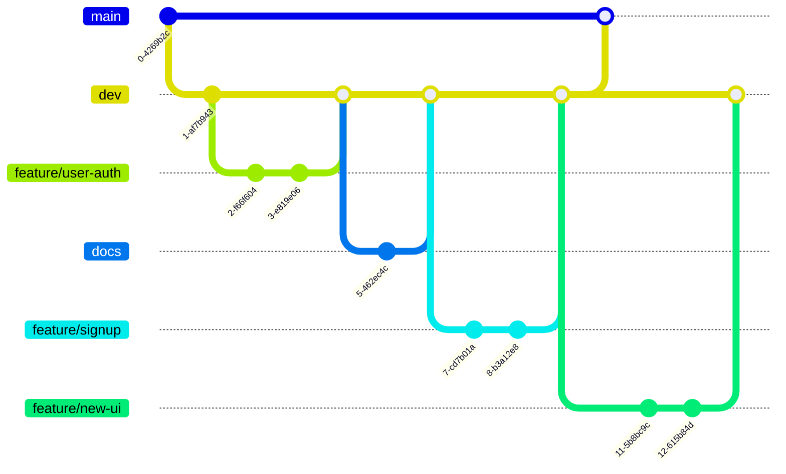

# SHARED_AGENT.md — PatentFlow Shared Agent Guide

This document contains shared rules for frontend, backend, and AI-agent developers working on PatentFlow.

Use this file for cross-team alignment. Use role-specific files such as `AGENTS.md` for frontend-only implementation details.

## Project Overview

PatentFlow is an internal patent management AI workflow system.

- Service name: PatentFlow
- Team name: SYUUK
- Topic: Internal patent management AI
- Product role: AI-assisted patent review workflow
- Goal: Help legal/patent management teams and business departments review company-owned patents around annual fee payment points.
- Product nature: Human-in-the-loop decision-support workflow system, not a simple report generator.

Core workflow:

```text
Review target identification
→ Patent understanding
→ AI patent evaluation report generation
→ Review and decision recording
→ Mailing / delivery
→ History management
→ Abandoned patent sales-candidate management
```

## Shared Domain Rules

- AI output is an evaluation report or recommendation, not the final recorded decision.
- The system must clearly separate `AI 특허 평가 레포트`, `최종 판단`, `사업부 의견`, and `평가 근거`.
- Current evaluation scoring uses only:
  - 권리성
  - 기술성
  - 시장성
  - 라이프사이클 경제성
- Do not include `사업 연계성` as a current scoring axis, enum value, checklist total, or AI score category unless explicitly requested.
- Business opinion categories are `유지` and `포기`.
- AI report recommendation labels are:
  - 유지 권고
  - 포기 검토
  - 추가 정보 필요
- Workflow status labels should describe process state, such as `사업부 응답 대기`, `결재 대기`, and `처리 완료`.
- Use `정보 부족 있음`, `추가 확인 필요`, and `N/A` only for missing, insufficient, or not-applicable source data.
- For not-yet-written user input, use state/action copy such as `작성 필요`, `대기 중`, or `의견 대기` instead of `N/A`.
- Checklist totals and detail scores must use the same source. Do not mix AI 0-100 evaluation scores with business checklist 1-4 item scores in one total.

## Fixed Functional Requirements

Do not change the meaning or numbering of FR-001 through FR-022.

- FR-001: 검토 대상 특허 조회
- FR-002: 특허 목록 검색/필터링/정렬
- FR-003: 특허 기본 정보 등록
- FR-004: 회사 컨텍스트 입력/수정
- FR-005: 특허 내용 요약 생성
- FR-006: AI 기반 특허 가치 재평가 수행
- FR-007: 평가 근거 제공
- FR-008: 종합 권고안 생성
- FR-009: 사업부 의견 입력
- FR-010: 내부 문서 반영 재평가
- FR-011: AI 특허 평가 레포트와 최종 판단 분리 조회/수정
- FR-012: 최종 의사결정 기록
- FR-013: 평가/판단 이력 조회
- FR-014: 부서별 수신자 및 메일링 매핑 등록/수정
- FR-015: 메일 미리보기
- FR-016: 메일 발송 이력 저장/조회
- FR-017: 포기 특허를 매각 후보 리스트로 분류/조회
- FR-018~FR-022: Already assumed in project planning. Do not renumber earlier requirements.

If a new requirement is needed, assign it from FR-023 onward only in documents.

## Shared Reference Docs

Use the project documents in `docs/` as the managed reference set.

- `docs/skax_patents_list.md`: primary source for demo patent metadata and patent list fixtures.
- `docs/patent_evaluation_criteria.md`: official patent evaluation criteria, evaluation axes, final comprehensive indicator, and final judgment categories.
- `docs/business_evaluavte_checklist.md`: business-side checklist reference and internal review inputs.
- `docs/api_priority.md`: frontend/backend API priority, MVP API response shape, and enum coordination.
- `docs/need_api.md`: additional API needs and integration notes when present.
- `docs/prompt.md`: AI prompt/reference content when prompt behavior affects API, mock AI report structure, or frontend copy.
- `docs/DESIGN_SYSTEM.md`: frontend UI tone and styling reference.

If implementation details conflict, follow this priority:

1. Explicit user or team decision
2. Fixed functional requirements and shared domain rules
3. Role-specific implementation guide such as `AGENTS.md`
4. Relevant `docs/` reference document

## Patent Metadata Contract

When using demo patent rows or fixtures, first check `docs/skax_patents_list.md`.

Use it as the primary source for:

- 관리번호
- 발명의 명칭(가제)
- 발명의 명칭(최종)
- 관련사업 분야
- 관련기술 분야
- 관련제품
- 출원국
- 공동출원여부
- 공동출원인명
- 상태
- 출원일
- 등록일
- 출원번호
- 등록번호
- 예상 소멸일

If evaluation summaries, recommendations, business opinions, or history are not present in the source document, create clearly marked mock/test data around the real patent metadata. Do not replace real metadata with invented patents.

## Shared Status And Enum Guidance

Prefer explicit domain values and keep Korean labels at the display layer.

Suggested shared domain values:

```ts
type PatentLifecycleStatus =
  | "ACTIVE"
  | "ABANDONED"
  | "SOLD"
  | "EXPIRED";

type ReviewWorkflowStatus =
  | "NOT_IN_REVIEW_QUARTER"
  | "REVIEW_QUARTER_STARTED"
  | "REPORT_GENERATED"
  | "MAIL_READY"
  | "WAITING_BUSINESS_RESPONSE"
  | "BUSINESS_RESPONSE_RECEIVED"
  | "WAITING_EXECUTIVE_APPROVAL"
  | "APPROVAL_COMPLETED"
  | "LEGAL_ACTION_RECORDED";

type Recommendation =
  | "MAINTAIN"
  | "REVIEW_AGAIN"
  | "ABANDON"
  | "SALES_CANDIDATE"
  | "HOLD";

type BusinessOpinionDecision =
  | "MAINTAIN"
  | "ABANDON";

type ExecutiveApprovalDecision =
  | "APPROVED_MAINTAIN"
  | "APPROVED_ABANDON"
  | "APPROVED_SELL"
  | "REJECTED"
  | "REQUEST_CHANGES";

type LegalActionResult =
  | "MAINTAINED"
  | "ABANDONED"
  | "SOLD";

type EvaluationCategory =
  | "RIGHTS"
  | "TECHNOLOGY"
  | "MARKET"
  | "LIFECYCLE_ECONOMICS";
```

## Shared API Expectations

Backend and AI services should expose data that lets the frontend display:

- Patent basic metadata
- Why the patent is under review
- Patent summary
- Problem solved by the patent
- Core technical points
- Rights / claims summary
- AI patent evaluation report
- Evaluation scores by current category
- Evidence for each evaluation item
- Missing information or not-applicable fields
- Final decision and legal action result
- Business department opinion
- Evaluation and decision history
- Mailing preview and mailing history
- Abandoned patent sales-candidate information

Frontend API client names may follow these examples:

```ts
getReviewTargetPatents()
getPatentDetail(patentId)
createPatent(payload)
updateCompanyContext(patentId, payload)
requestPatentSummary(patentId)
requestPatentEvaluation(patentId)
submitBusinessOpinion(patentId, payload)
uploadInternalDocumentForReevaluation(patentId, file)
getEvaluationHistory(patentId)
previewMailing(payload)
getMailingHistory()
getSalesCandidates()
```

## Traceability Rules

Important frontend pages, backend APIs, AI-agent prompts, test fixtures, mock data, and major utilities should be traceable to FR IDs.

When a UI relationship is relevant, also include the official UI ID.

Official UI IDs:

| UI ID | 화면명 | 사용자 | 설명 |
|---|---|---|---|
| UI-001 | 로그인 | 공통 | 관리자/사업부 사용자가 로그인하고 역할에 따라 화면 진입 |
| UI-002 | 대시보드 | 관리자 | 검토 대상 특허, 만료 임박 특허, 상태 요약 확인 |
| UI-003 | 특허관리 | 관리자 | 전체 특허 목록 조회, 검색, 필터링, 정렬, 일괄 업로드 |
| UI-004 | 특허 등록/수정 | 관리자 | 특허 기본 정보, 회사 컨텍스트 정보 등록 및 수정 |
| UI-005 | 특허상세 | 관리자, 사업부 사용자 | 특허 요약, AI 평가 결과, 근거, 권고안, 최종 판단을 확인하는 상세 화면 |
| UI-006 | 사업부 마이페이지 | 사업부 사용자 | 사업부가 검토 요청받은 특허 목록을 확인하고 의견을 입력하는 화면 |
| UI-007 | 메일링 | 관리자 | 메일 미리보기, 수신자 매핑, 발송 내역 조회 |
| UI-008 | 설정 | 관리자 | 운영 기준, 평가 기준, 메일링 매핑 정보 설정 |
| UI-009 | 레포트 | 관리자, 사업부 사용자 | 평가 이력, 최종 판단 이력, 매각 후보 리스트, AI 피드백 조회 |

Do not invent another final UI ID system. If the UI ID is unknown, use `TODO-UI-ID`.

Example comment:

```ts
/**
 * @relatedFR FR-006, FR-007, FR-008
 * @relatedUI UI-005
 * @description AI 특허 평가 레포트와 평가 근거를 조회한다.
 */
```

## Code And Comment Guidelines

- Read the existing structure before changing code.
- Make the smallest safe change that satisfies the request.
- Match existing naming, style, directory structure, and conventions.
- Do not add unnecessary dependencies.
- Do not rewrite, reformat, or refactor unrelated files.
- Do not remove existing behavior unless explicitly requested.
- Keep comments useful and traceable. Prefer FR/UI purpose comments over obvious implementation narration.
- Remove only unused code created by your own change.
- If unrelated cleanup is noticed, report it instead of changing it.

## Work Rules

### Think Before Coding

- Do not assume unclear requirements. State assumptions explicitly, and ask when a reasonable assumption would be risky.
- If multiple interpretations exist, mention the tradeoff before choosing an implementation path.
- If a simpler approach solves the request, prefer it.
- Push back when a requested change conflicts with shared domain rules, FR/UI traceability, or existing project constraints.

### Simplicity First

- Implement the minimum code that satisfies the requested behavior.
- Do not add features, abstractions, flexibility, configuration, or defensive error handling that the task does not need.
- Avoid single-use abstractions unless they clearly reduce real complexity or match an existing pattern.

### Surgical Changes

- Touch only files and lines directly related to the task.
- Do not improve adjacent code unless required for the task.
- Match existing style even when a different style would be personally preferred.
- Every changed line should trace back to the request.

### Goal-Driven Execution

- Convert the request into verifiable success criteria before implementing.
- For bug fixes, prefer reproducing the issue with a focused test or check before changing behavior.
- For refactors, verify behavior before and after when practical.
- Report verification honestly. Do not claim tests passed unless the exact command was run.

## Git Workflow

### Branch Strategy

Use GitHub Flow with a shared `dev` branch before `main`.

```text
feature/name → PR → dev → main
```

Branch roles:

| Branch | Description |
|---|---|
| `main` | 즉각적으로 배포가 가능한 상태 |
| `dev` | `main` 브랜치에 올라가기 전에 기능을 합치고 문제가 있는지 점검 |
| `feature/name` | `dev` 브랜치를 기준으로 생성한다. `name`은 기능 요약을 영어로 적절히 번역하여 작성한다. |
| `fix/name` | `dev` 브랜치를 기준으로 생성한다. 버그 수정이나 작은 보완 작업에 사용한다. |
| `docs` | 문서화 작업 용도로 사용한다. |

Example flow:



### Commit Size

- Keep commits reviewable and focused.
- One commit should not exceed 50 changed lines in a single file when practical.
- Review AI-generated code before committing it.

### Commit Message

Use the Udacity-style prefix format.

- Do not use emojis.
- Write commit messages in Korean.
- Make the first line clear enough to understand the change by itself.

Format:

```text
<커밋_타입>: <수정사항_한줄_요약> (<#이슈넘버>)
```

The issue number is optional and should be used when the commit is tied to a specific bug, task, or issue.

Commit types:

| Type | Description |
|---|---|
| `feat` | 새로운 기능 추가 |
| `fix` | 버그 수정 |
| `docs` | 문서 변경 |
| `style` | 포매팅, 누락된 세미콜론 등 코드 의미 변경 없음 |
| `refactor` | 프로덕션 코드 리팩토링 |
| `test` | 테스트 추가 또는 테스트 리팩토링. 프로덕션 코드 변경 없음 |
| `chore` | 빌드 작업, 패키지 관리자 구성 업데이트 등. 프로덕션 코드 변경 없음 |

Examples:

```text
feat: 특허 상세 AI 평가 레포트 영역 추가 (#12)
fix: 사업부 의견 제출 상태 표시 오류 수정 (#18)
docs: 공통 에이전트 작업 규칙 추가
chore: vite react typescript 환경 설정 (#76)
```

### Pull Request Guide

- Merge into `dev` with squash and merge.
- Merge `dev` into `main` with a normal merge.
- When merging a PR, keep the commit title prefixed with the same commit type format.
- Example: `chore: vite react typescript 환경 설정 (#76)`

## Verification

Use the commands available in each repository. Common frontend commands are:

```bash
npm run lint
npm run build
npm test
```

Backend and AI-agent repositories should use their own test, lint, and build commands.

Before reporting completion, include:

1. What changed
2. Related FR/UI IDs when applicable
3. API or mock assumptions
4. Commands run
5. Remaining TODOs or integration points
